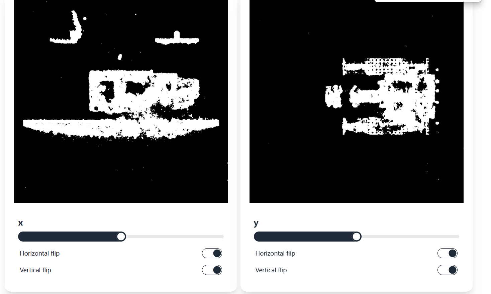

# Volume Viewer

## How to use

1. install dependencies

```bash
pnpm install
```

2. run dev server

```bash
pnpm dev
```

3. open http://localhost:5173

4. load volume data

## Data format

- npy file
- 3D array
- float32
- shape: (H, W, D)

## License

MIT

## Screenshots


